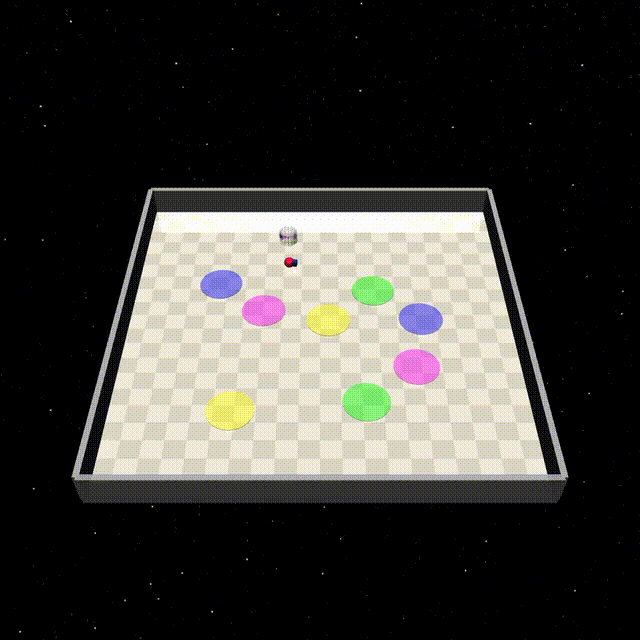

<h1 align="center">
<br>
One Subgoal at a Time: Zero-Shot Generalization to Arbitrary Linear Temporal Logic Requirements in Multi-Task Reinforcement Learning
</h1>

<p align="center">
Repo for "<a href="https://www.arxiv.org/abs/2508.01561" target="_blank">GenZ-LTL: <u>Gen</u>eralization <u>Z</u>ero-Shot to arbitrary <u>L</u>inear <u>T</u>emporal <u>L</u>ogic requirements</a>" [NeurIPS 2025]
</p>

## Method

**GenZ-LTL** is an RL framework that enables zero-shot generalization to arbitrary LTL specifications. It leverages Büchi automata to decompose tasks into sequential reach-avoid subgoals and, unlike prior methods that condition on entire subgoal sequences or the automata, it solves these reach-avoid problems one subgoal at a time via a safe RL formulation based on Hamilton–Jacobi (HJ) reachability. In addition, it uses subgoal-induced observation reduction to further mitigates the exponential complexity of subgoal–state combinations.

## Installation

The code is adapted from [DeepLTL](https://github.com/mathiasj33/deep-ltl) and requires Python 3.10 and PyTorch (tested with version 2.2.2). To use the _ZoneEnv_ environment, use the following command to install the required dependencies:
```bash
conda activate genzltl
cd src/envs/zones/safety-gymnasium
pip install -e .
```
To install the remaining dependencies, run
```bash
pip install -r requirements.txt
```
We use [_Rabinizer 4_](https://www7.in.tum.de/~kretinsk/rabinizer4.html) to convert LTL formulae into automata. This requires Java 11 to be installed.

## Training

Models can be trained using the scripts in `src/train`. We provide scripts to train a model with the default parameters in the environments (_LetterWorld_: LetterSafetyEnv-v0 and _ZoneEnv_: PointLltSafety2-v0). For example, to launch training on the _ZoneEnv_, run
```bash
PYTHONPATH=src/ python run_zones_safety.py --script train_rco --device gpu --name GenZ-LTL --seed 1
```
All experiment logs and model checkpoints will be stored in the `experiments` directory.

## Evaluation

**The pre-trained models are located in the `experiment` folder.**
The evaluation scripts are in `src/evaluation`. To evaluate a trained model on a specific LTL formula:
```bash
PYTHONPATH=src/ python src/evaluation/simulate.py --env <env_name> --exp GenZ-LTL --seed 1 --formula <LTL_spec>
```

For a more comprehensive evaluation across multiple LTL specifications, run:
```bash
# finite-horizon tasks
PYTHONPATH=src/ python src/evaluation/eval_test_tasks_finite.py --exp GenZ-LTL --env <env_name> --exp GenZ-LTL --seed 1

# infinite-horizon tasks
PYTHONPATH=src/ python src/evaluation/eval_test_tasks_infinite.py --exp GenZ-LTL --env <env_name> --exp GenZ-LTL --seed 1
```
The results will be stored in the `results_finite` and `results_infinite` directories, respectively.

## Visualizations
We present visualization results of the policy learned by GenZ-LTL in the Zone environment. The method consistently achieves the desired behavior under both complex finite-horizon and infinite-horizon specifications.

<div align="center" style="display: flex; flex-wrap: wrap; justify-content: center; gap: 20px;">
  <div style="flex: 0 0 45%; text-align: center;">
    <br>
    !green U ((blue | magenta) & (!green U yellow))
  </div>
  <div style="flex: 0 0 45%; text-align: center;">
    <br>
    !(magenta | yellow) U (blue & (!green U (yellow & F (green & (!blue U magenta)))))
  </div>
  <div style="flex: 0 0 45%; text-align: center;">
    <br>
    FG yellow & G !(green | blue | magenta)
  </div>
  <div style="flex: 0 0 45%; text-align: center;">
    <br>
    GF blue & GF green & G !(yellow | magenta)
  </div>
</div>


## Bibtex

If you find our work useful, please cite it as:
```
@inproceedings{guo2025one,
  title={One Subgoal at a Time: Zero-Shot Generalization to Arbitrary Linear Temporal Logic Requirements in Multi-Task Reinforcement Learning},
  author={Guo, Zijian and I{\c{s}}{\i}k, {\.I}lker and Ahmad, HM and Li, Wenchao},
  booktitle={The Thirty-ninth Annual Conference on Neural Information Processing Systems},
  year={2025}
}
```
